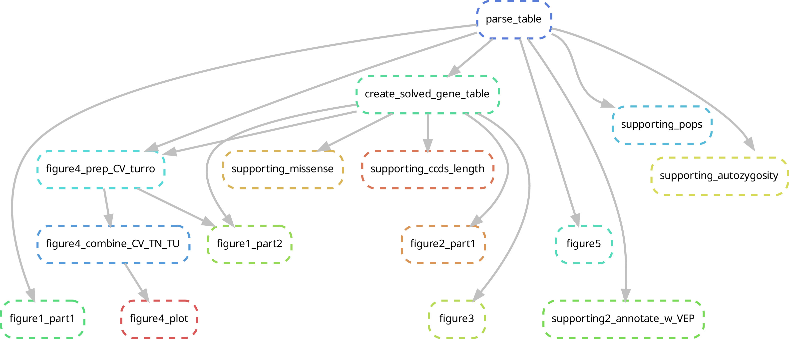

# TNAMSE - analysis of phenotypic and molecular data

Scripts for producing the figures of the analysis of the phenotypic and molecular data of the TRANSLATE-NAMSE project. The individual R-scripts were integrated in an automated snakemake pipeline to facilitate regeneration of analyses during data cleaning. Individual R-scripts are named according to the figures for which they yield the data.

You can either run the whole pipeline, or you can run scripts individually.

### General

Clone the repository, then install the tnamse conda environment that can be found in envs/tnamse.yaml .

```
conda env update -n tnamse --file workflow/envs/tnamse.yaml
```

The R-packages webr / moonBook have to be installed manually, as it is not available via conda. Install them in R via:

- Run R:
```
conda activate tnamse
R 
```
- Then run the following code within R:
```
if(!require(devtools)) install.packages("devtools", repos='http://cran.us.r-project.org') 
devtools::install_github("cardiomoon/moonBook", upgrade="never") 
devtools::install_github("cardiomoon/webr", upgrade="never")
quit(save="no")
```

Finally you need to add two supplemental files to the folder "resources":
- Supplementary\_Table\_1\_ES\_cohort.xlsx
- Supplementary\_Table\_3\_Novel.xlsx

To run the code "figure1_part2.R" / snakemake rule "figure1_part2" as well as snakemake rule "supporting_ccds_length" / code "supp_CCDS_process_files.R" and "supp_CCDS_plot.R", files from OMIM are required. 
Therefore, you need to aquire a licence for data download from OMIM (see omim.org/downloads) if you would like to run this code. 
If you have obtained the license, you can contact and I can provide you with the original files, that should be saved to "resources/":
- genemap2\_15\_07\_2021.txt
- genes\_to\_phenotype.txt
- mimTitles.txt

You can currently download all files from: https://uni-bonn.sciebo.de/s/EZcIsUYItdBSiJw

### Running the snakemake pipeline

Then modify the file config.yaml to point to the locations where the TRANSLATE NAMSE data are stored.

Now you should be able to run snakemake by executing:

```
conda activate tnamse
snakemake -c1 --use-conda # you can increase the 1 behind -c to the number of threads you want to use
```

The naming within the workflow is related to the accompanying manuscript (figures/suppl figures). Here you can see the graph of the rules and dependencies:



The output will be placed into the folder "results/".


### Running individual R scripts

If you would like to play around with the data you can do the following:

Go to the directory "workflow/scripts/". Here you can run individual scripts. 

However, in every skript you have to skipt the line "args = commandArgs(trailingOnly=TRUE)".

Most scripts require the output of the two scripts "parse_table.Rmd" and "supp_solved_cases.Rmd" - it is therefore reasonable to run these first.


### Additional information on files in the resources folder

You can find additional information on the files in the resources folder in this additional [README file](resources/README.md).

### Questions / Issues

If you have issues - just raise a github issue. If you have questions just get in touch.

